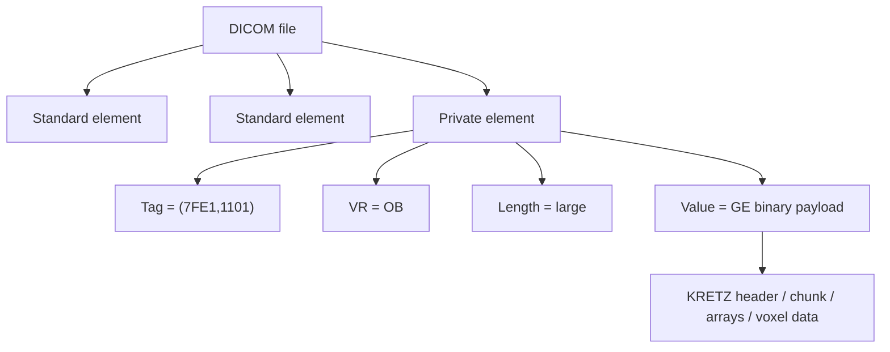
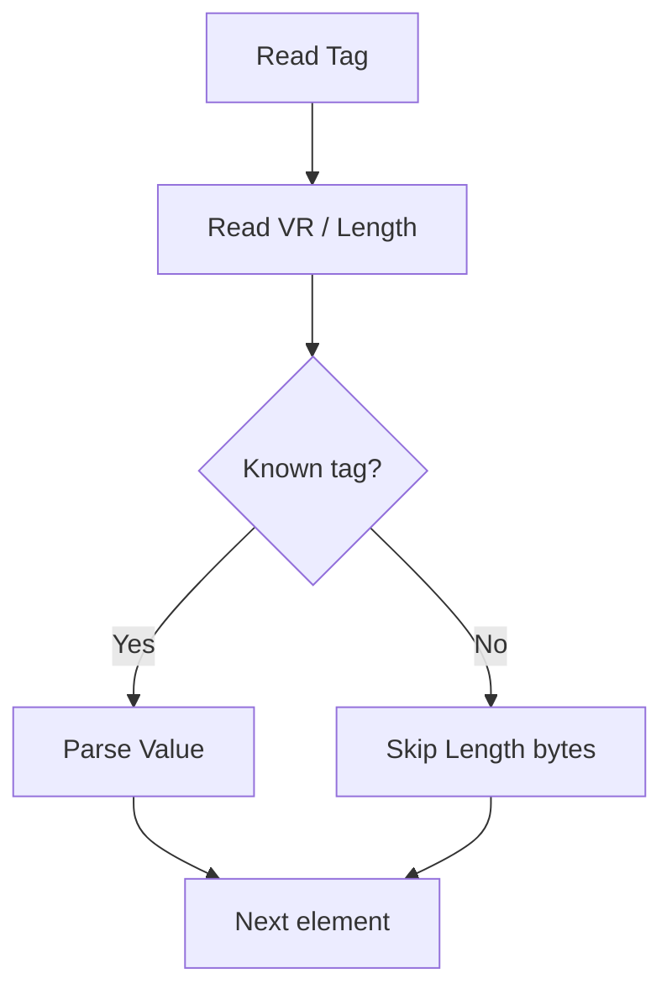
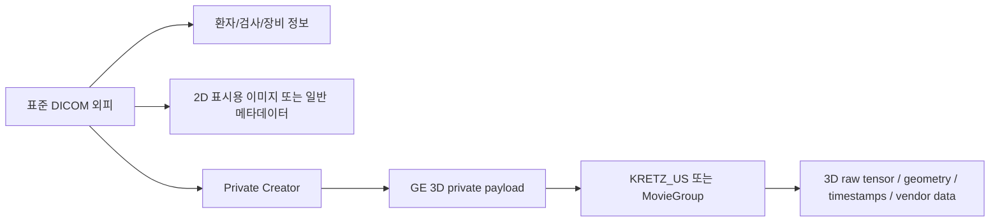
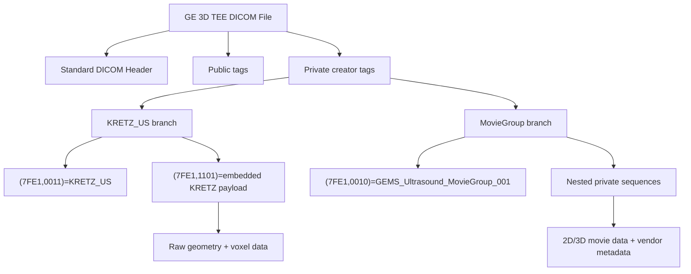
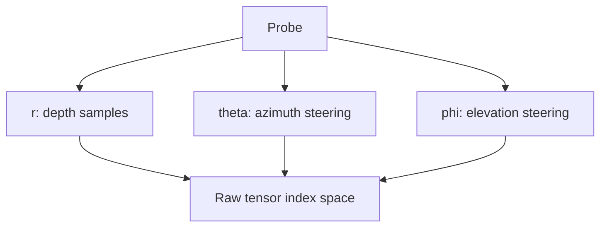
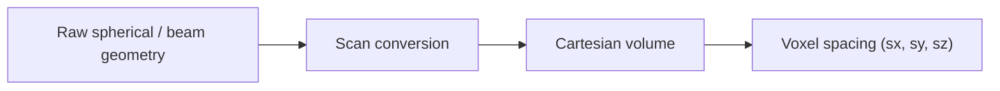
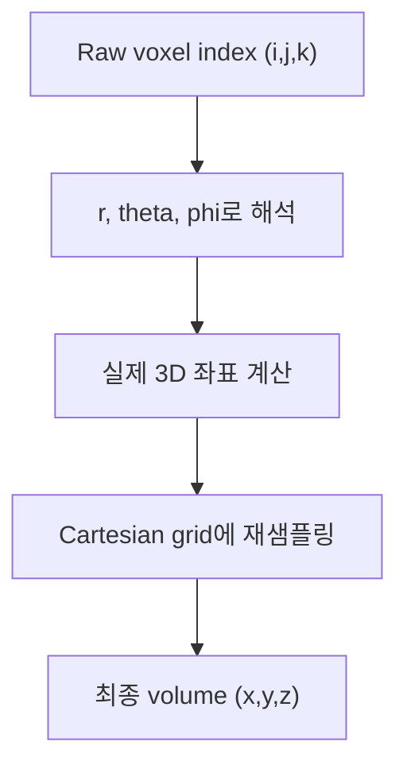

# GE Vivid 3D TEE DICOM 구조 총정리

## 문서 목적

이 문서는 GE Vivid 계열 3D TEE DICOM 파일이 **겉으로는 표준 DICOM**, **속으로는 GE private 3D payload**를 담는 구조를 어떻게 가지는지 한 번에 이해할 수 있도록 정리한 문서다.

특히 다음 질문에 답하는 데 초점을 둔다.

- DICOM 파일은 바이트 수준에서 어떻게 생겼는가
- GE 3D TEE 파일은 왜 일반 DICOM과 다르게 보이는가
- `KRETZ_US`와 `MovieGroup`는 각각 무엇인가
- raw 3D geometry는 무엇이고, scan conversion 뒤 spacing은 무엇인가
- 실제 분석 시 어떤 부분을 믿고 어떤 부분을 조심해야 하는가

---

## 1. 한 장 요약

GE Vivid 3D TEE DICOM은 아래처럼 이해하면 가장 쉽다.

1. 바깥 껍데기는 표준 DICOM이다.  
   병원 PACS, DICOM 뷰어, 저장 시스템과 호환되기 위해 필요하다.

2. 안쪽 핵심은 GE private payload다.  
   3D raw tensor, angle array, geometry, vendor-specific 메타데이터는 보통 private tag에 숨는다.

3. 따라서 이 파일은 사실상 아래 두 층으로 봐야 한다.

- 표준 DICOM 층
- GE private 3D 층

4. spacing도 두 종류로 나뉜다.

- raw spacing: `radial resolution + theta/phi angle array`
- scan-converted spacing: Cartesian volume voxel spacing

즉 “spacing 하나”만 찾는 문제처럼 보이지만, 실제로는 **좌표계가 두 번 바뀌는 구조**다.

### 바깥 DICOM 레벨 vs 안쪽 GE payload 레벨

이 구조를 가장 헷갈리지 않게 이해하는 방법은 파일을 **2층 구조**로 보는 것이다.

```text
Layer 1: 바깥 DICOM 레벨
  [Tag][VR][Length][Value]
  [Tag][VR][Length][Value]
  [Tag][VR][Length][Value]
  ...
  [Private Tag][VR][Length][Value]

Layer 2: 안쪽 GE payload 레벨
  위 Private Tag의 Value 안쪽에
  GE가 정의한 별도 바이너리 구조가 들어 있음
```

즉 중요한 점은 다음이다.

- private tag가 나왔다고 해서 DICOM 형식이 깨지는 것은 아니다
- **private tag 자체는 끝까지 DICOM element**다
- 다만 그 tag의 `Value` 안에 GE 전용 포맷이 들어 있는 것이다

아래 그림으로 보면 더 직관적이다.



즉 “private tag 뒤부터는 DICOM이 아니다”가 아니라,  
**“private tag의 value 내부가 GE 독자 바이너리 포맷이다”**가 정확한 표현이다.

---

## 2. DICOM 기본 구조

DICOM은 결국 바이트 스트림 위에 `Data Element`가 반복되는 구조다.

각 element는 대체로 아래처럼 저장된다.

```text
[Tag] [VR] [Length] [Value]
```

파일 전체 구조는 보통 다음과 같다.

```text
┌──────────────────────────────┐
│ 128-byte preamble           │
├──────────────────────────────┤
│ "DICM" prefix               │
├──────────────────────────────┤
│ File Meta Information       │
├──────────────────────────────┤
│ Standard/Public Tags        │
├──────────────────────────────┤
│ Private Creator Tags        │
├──────────────────────────────┤
│ Private Payload Tags        │
└──────────────────────────────┘
```

아래 그림처럼, 파서는 태그를 읽고, 길이를 보고, 알면 해석하고 모르면 건너뛴다.



이 “모르면 length만큼 건너뛴다”는 성질 때문에, GE private 영역을 모르는 범용 뷰어도 파일 전체가 깨지지 않고 동작할 수 있다.

### 실제 파싱 예시: `(7FE1,0011)`에서 value 찾기

예를 들어 GE KRETZ 파일에서 다음 private creator를 본다고 하자.

```text
(7FE1,0011) LO "KRETZ_US"
```

이 표현은 사람이 보기 쉽게 풀어 쓴 것이고, 실제 파일에서는 대략 아래 순서로 저장된다.

```text
[Tag]         [VR] [Length] [Value]
7FE1,0011      LO   0008     "KRETZ_US"
```

리틀 엔디안 파일이라면 바이트 레벨에서는 개념적으로 이렇게 볼 수 있다.

```text
E1 7F 11 00   4C 4F   08 00   4B 52 45 54 5A 5F 55 53
│  │  │  │    │  │    │  │    └──────────── value = "KRETZ_US"
│  │  │  │    │  │    └─ length = 8 bytes
│  │  │  │    └─ VR = LO
└─────────────── tag = (7FE1,0011)
```

여기서 파서는 다음 순서로 움직인다.

1. 먼저 4바이트를 읽어 `(Group, Element)`를 만든다.  
   이 경우 `(7FE1,0011)`이다.

2. 다음 2바이트를 읽어 `VR`을 해석한다.  
   여기서는 `LO`다.

3. 다음 2바이트 또는 4바이트를 읽어 `Length`를 얻는다.  
   여기서는 `8`이다.

4. 그 뒤의 8바이트를 읽으면 그 태그의 실제 `Value`가 된다.  
   즉 `"KRETZ_US"`다.

즉 태그만 보고 바로 점프하는 것이 아니라, **파일을 순차적으로 읽다가 원하는 태그를 만나면 Length를 읽고 그 뒤 Value를 해석하는 구조**다.

아래처럼 생각하면 된다.


파이썬에서 `pydicom`을 쓰면 이 과정을 직접 구현하지 않아도 된다.

```python
import pydicom

ds = pydicom.dcmread("file.dcm")
value = ds[(0x7FE1, 0x0011)].value
print(value)  # KRETZ_US
```

GE 3D TEE 구조를 분석할 때 이 예시가 중요한 이유는, 결국 `(7FE1,0011)` 같은 private creator를 먼저 읽고 나서야 그 다음 private payload `(7FE1,1101)` 같은 값의 의미를 추적할 수 있기 때문이다.

즉 실전에서는 보통 아래 순서로 간다.

```text
(7FE1,0011) -> "이 private block의 소유자가 누구인지 확인"
(7FE1,1101) -> "그 소유자가 넣은 실제 payload 읽기"
```

---

## 3. 왜 GE 3D TEE DICOM은 특이한가

GE는 완전 독자 포맷만 쓰지 않고 DICOM을 제공한다. 이유는 병원 환경이 DICOM 중심으로 돌아가기 때문이다.

하지만 동시에 GE는 3D raw geometry, 전용 렌더링 로직, 내부 메타데이터를 표준 태그에 모두 공개하지 않는다.

그래서 실제 구조는 아래와 같은 **트로이 목마형 하이브리드**가 된다.



즉:

- 병원 시스템에는 DICOM처럼 보이게 한다
- 진짜 3D 핵심 데이터는 private로 숨긴다

이 구조 덕분에 PACS에는 저장되지만, 범용 뷰어는 보통 2D만 보여주고 3D를 완전히 복원하지 못한다.

---

## 4. GE 파일에서 자주 보이는 두 가지 private 구조

GE 3D TEE DICOM에서는 크게 두 계열을 많이 의식해야 한다.

### 4.1 `KRETZ_US`

대표적인 direct parse 대상이다.

주요 특징:

- `(7FE1,0011) = KRETZ_US`
- `(7FE1,1101)`에 대형 payload 존재
- payload 시작이 보통 `KRETZFILE 1.0   `

즉 DICOM 안에 또 하나의 GE/Kretz 내부 포맷이 들어 있는 구조다.

### 4.2 `GEMS_Ultrasound_MovieGroup_001`

주요 특징:

- `(7FE1,0010) = GEMS_Ultrasound_MovieGroup_001`
- 내부가 sequence 계층처럼 보일 수 있음
- 2D/2D+t와 3D가 함께 섞일 수 있음
- 일부 경우 Image3DAPI나 vendor DLL이 필요

실무적으로는 다음처럼 접근하면 좋다.

- `KRETZ_US`면 direct parse 우선
- `MovieGroup`면 external reader 우선

---

## 5. GE 3D TEE DICOM의 전체 레이어 구조

아래 도식이 가장 실전적이다.



이 문서에서 구조를 구체적으로 이해하기 가장 좋은 대상은 `KRETZ_US` 쪽이다. 공개 구현에서도 상대적으로 많이 드러나 있기 때문이다.

---

## 6. KRETZ payload 내부 구조

SlicerHeart의 공개 reader 구현 기준으로 보면, KRETZ payload는 다음 정보를 읽는다.

| Item | 의미 |
|---|---|
| `(C000,0001)` | Dimension I |
| `(C000,0002)` | Dimension J |
| `(C000,0003)` | Dimension K |
| `(C100,0001)` | Radial resolution |
| `(C200,0001)` | offset1 |
| `(C200,0002)` | offset2 |
| `(C300,0001)` | Phi angle array |
| `(C300,0002)` | Theta angle array |
| `(0010,0022)` | Cartesian spacing candidate |
| `(D000,0001)` | Voxel data |

구조적으로 보면 아래와 같다.

```text
KRETZFILE 1.0
 ├─ Dimension I
 ├─ Dimension J
 ├─ Dimension K
 ├─ Radial resolution
 ├─ Offset1
 ├─ Offset2
 ├─ Phi angle array
 ├─ Theta angle array
 ├─ Cartesian spacing candidate
 └─ Voxel data
```

이때 중요한 포인트는:

- `Dimension I/J/K`는 텐서 크기
- `radial resolution`은 깊이 방향 샘플 간격
- `theta/phi array`는 각 index가 실제 어느 각도인지 정의
- `voxel data`는 실제 intensity

즉 raw geometry는 **mm 하나 + 두 개의 angle array** 조합으로 정의된다.

---

## 7. raw 텐서의 좌표계

raw 3D 초음파는 처음부터 `x, y, z` Cartesian volume이 아니다.

보통 아래처럼 생각하는 것이 더 맞다.

```text
Raw[i, j, k]

i -> depth (r)
j -> azimuth (theta)
k -> elevation (phi)
```

좀 더 직관적으로 쓰면:

```text
Raw[r_index, theta_index, phi_index]
```

이 좌표계는 부채꼴 또는 피라미드형 탐촉자 geometry에 더 가깝다.



그래서 raw 상태에서는 다음이 성립하지 않는다.

```text
1 voxel = 고정된 1 mm
```

대신 다음이 맞다.

- depth 1 index = 거의 고정 mm 간격
- theta 1 index = 각도 간격
- phi 1 index = 각도 간격

즉 lateral/elevation 방향의 실제 mm 간격은 depth에 따라 달라진다.

---

## 8. raw spacing과 scan-converted spacing의 차이

이 부분이 가장 중요하다.

### 8.1 raw spacing

raw acquisition geometry의 본질은 아래다.

- `radial_resolution_mm`
- `theta_angles`
- `phi_angles`
- `offset1`, `offset2`

이것이 “진짜 원본 spacing”에 해당한다.

### 8.2 scan-converted spacing

scan conversion을 거치면 비로소 Cartesian voxel grid가 만들어진다.

그 뒤에는 다음처럼 말할 수 있다.

```text
(sx, sy, sz) mm per voxel
```

즉 이때의 spacing은 **재구성된 볼륨의 voxel spacing**이다.



실무적으로는 아래처럼 구분해야 한다.

| 질문 | 봐야 하는 값 |
|---|---|
| 원본 장비 geometry가 무엇인가 | raw spacing |
| 재구성 volume에서 길이 측정을 하고 싶은가 | scan-converted spacing |
| 왜곡 없이 volume이 보이는가 | raw geometry + chosen output spacing |

---

## 9. scan conversion은 실제로 무엇을 하나

scan conversion은 raw 텐서의 각 sample이 실제 3D 공간에서 어디에 놓여야 하는지 계산해, Cartesian 격자에 다시 채우는 과정이다.

개념적으로는 다음 단계다.



여기서 중요한 것은, 최종 output spacing은 사용자가 정하는 reconstruction grid일 수 있다는 점이다.

예를 들어:

- `0.333 mm`
- `0.667 mm`
- `1.0 mm`

같은 값을 선택할 수 있다.

따라서 scan-converted spacing은 “원본에 박혀 있던 절대 진실”이라기보다, **raw geometry를 바탕으로 다시 만든 결과 grid**일 수도 있다.

---

## 10. 구조를 읽을 때 실제로 보는 순서

실무에서는 아래 순서가 가장 효율적이다.

### 1단계: DICOM 외피 확인

- `SOPClassUID`
- `Manufacturer`
- `ManufacturerModelName`
- public spacing 후보 태그
- private creator 목록

### 2단계: GE private branch 식별

- `(7FE1,0011)=KRETZ_US` 인가
- `(7FE1,0010)=GEMS_Ultrasound_MovieGroup_001` 인가

### 3단계: payload 내부 구조 확인

`KRETZ_US`면:

- dimensions
- radial resolution
- offsets
- theta/phi arrays
- voxel data

### 4단계: geometry 해석

- raw spacing 요약
- sector 범위 계산
- depth 범위 계산
- lateral arc length가 depth에 따라 어떻게 변하는지 확인

### 5단계: scan conversion 결과 확인

- chosen output spacing
- 재구성 volume shape
- 중심 슬라이스
- MIP 또는 sector outline

---

## 11. 시각적으로 이해하는 핵심 그림

### 11.1 파일 구조

```text
DICOM file
 ├─ Standard tags
 ├─ Standard image / metadata
 ├─ Private creator
 └─ GE private payload
      ├─ KRETZ_US
      │   ├─ dimensions
      │   ├─ radial resolution
      │   ├─ theta/phi arrays
      │   └─ voxel data
      └─ MovieGroup
          ├─ nested sequence
          ├─ movie/image groups
          └─ vendor metadata
```

### 11.2 좌표계 변화

```text
Raw space
  (r, theta, phi)
       |
       | scan conversion
       v
Cartesian space
  (x, y, z)
```

### 11.3 spacing 변화

```text
Raw:
  depth = mm
  azimuth = degree
  elevation = degree

After scan conversion:
  x = mm
  y = mm
  z = mm
```

---

## 12. 실무에서 가장 자주 헷갈리는 포인트

### 1. `PixelSpacing`만 보면 안 된다

표준 DICOM 태그의 `PixelSpacing`이 있다 해도, 그 값이 GE 3D raw geometry를 직접 설명하는 것은 아닐 수 있다. 종종 2D display layer 기준일 수 있다.

### 2. scan-converted spacing을 raw spacing으로 오해하면 안 된다

재구성 volume에서 `0.667 mm`라고 보여도, 원본 acquisition spacing이 `0.667 mm isotropic`이었다는 뜻은 아니다.

### 3. `theta/phi`는 고정 mm가 아니다

각도 array를 가진다는 뜻은 lateral/elevation에서 실제 mm 간격이 depth에 따라 변한다는 뜻이다.

### 4. MovieGroup은 direct parse가 항상 쉽지 않다

공개 구현만으로 완전한 3D spacing을 복원하기 어려운 경우가 있어서, Image3DAPI나 vendor reader가 필요할 수 있다.

---

## 13. 이 구조를 문서/코드에서 어떻게 표현하면 좋은가

프로젝트 문서나 코드에서 아래 용어를 분리해서 쓰는 것이 좋다.

### 권장 용어

- `raw_geometry`
- `radial_resolution_mm`
- `theta_angles_rad`
- `phi_angles_rad`
- `scan_converted_spacing_mm`
- `output_spacing_mm`

### 피해야 하는 모호한 표현

- 그냥 `spacing`
- 그냥 `resolution`

이렇게 쓰면 raw spacing과 scan-converted spacing이 섞이기 쉽다.

---

## 14. 결론

GE Vivid 3D TEE DICOM은 단순한 의료 이미지 파일이 아니라, **표준 DICOM 외피 안에 GE private 3D geometry를 숨긴 이중 구조 파일**이다.

이 파일을 제대로 이해하려면 다음을 분리해서 봐야 한다.

1. 표준 DICOM 구조
2. GE private branch
3. raw geometry
4. scan conversion 결과

핵심만 다시 요약하면:

- `KRETZ_US`는 direct parse하기 좋은 GE private payload 구조다
- raw spacing은 `radial resolution + theta/phi arrays` 조합이다
- scan-converted spacing은 재구성 volume의 voxel spacing이다
- 따라서 “spacing을 찾는다”는 문제는 사실 “좌표계 전환 전체를 이해한다”는 문제에 가깝다

---

## 참고 구현 / 참고 자료

아래 공개 구현을 보면 실제 reader가 어떤 tag와 item을 읽는지 확인할 수 있다.

- [SlicerHeart repository](https://github.com/SlicerHeart/SlicerHeart)
- [DicomUltrasoundPlugin.py](https://raw.githubusercontent.com/SlicerHeart/SlicerHeart/master/DicomUltrasoundPlugin/DicomUltrasoundPlugin.py)
- [KretzFileReader logic](https://raw.githubusercontent.com/SlicerHeart/SlicerHeart/master/KretzFileReader/Logic/vtkSlicerKretzFileReaderLogic.cxx)
- [GeUsMovieReader logic](https://raw.githubusercontent.com/SlicerHeart/SlicerHeart/master/GeUsMovieReader/Logic/vtkSlicerGeUsMovieReaderLogic.cxx)
- [Image import notes](https://raw.githubusercontent.com/SlicerHeart/SlicerHeart/master/Docs/ImageImportExport.md)
