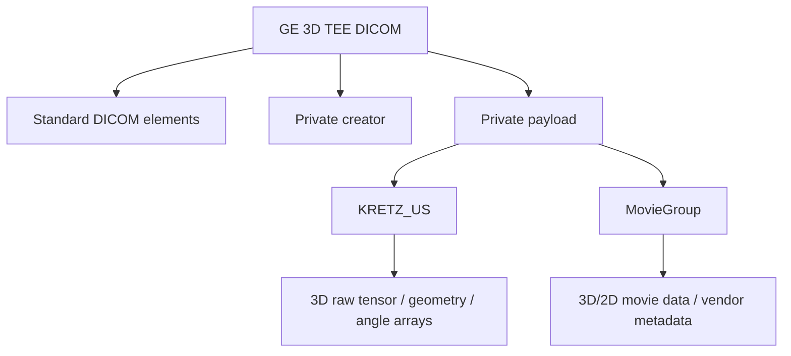

# GE Vivid 3D TEE DICOM 구조 총정리

## 문서 목적

GE Vivid 계열 3D TEE DICOM 파일의 구조를 빠르게 파악할 수 있도록 정리한 참조 문서다.  
특히 아래 항목을 한 번에 이해할 수 있도록 정리한다.

- GE 3D TEE DICOM이 일반 DICOM과 어떻게 다른가
- `KRETZ_US`와 `MovieGroup`는 각각 어떤 역할을 하는가
- 3D raw geometry와 scan-converted volume spacing은 어떻게 구분해야 하는가
- 실제 분석/구현 시 어떤 정보를 신뢰하고 어떤 점을 주의해야 하는가

---

## 1. 핵심 결론

1. GE Vivid 3D TEE 파일은 `표준 DICOM 외피 + GE private 3D payload`의 이중 구조로 보는 것이 가장 정확하다.
2. 범용 DICOM 뷰어는 표준 태그와 일부 2D 정보는 읽을 수 있지만, 핵심 3D 데이터는 private payload를 해석하지 못하면 완전 복원할 수 없다.
3. GE 3D 데이터의 spacing은 하나로 끝나지 않는다.
   - `raw geometry`: radial resolution + theta/phi angle array 기반
   - `scan-converted spacing`: Cartesian volume voxel spacing
4. 실제 길이/면적/부피 계산은 어떤 좌표계를 기준으로 할지 먼저 확정해야 한다.
5. `KRETZ_US` 계열은 공개 구현을 참고한 direct parse가 상대적으로 가능하고, `MovieGroup` 계열은 vendor-specific reader 의존성이 더 클 수 있다.

---

## 2. 전체 구조 요약

GE 3D TEE DICOM은 아래 두 층으로 이해하는 것이 가장 쉽다.

```text
Layer 1. Standard DICOM layer
  - 환자/검사/장비 정보
  - 표준 메타데이터
  - 일부 2D 표시용 정보
  - private creator / private payload container

Layer 2. GE private 3D layer
  - raw 3D tensor
  - geometry 정보
  - angle array
  - vendor-specific metadata
  - 경우에 따라 scan conversion 관련 정보
```

즉 private tag가 등장한다고 해서 DICOM 형식이 깨지는 것이 아니라,  
`private tag의 value 내부에 GE 전용 바이너리 구조가 들어 있는 형태`로 보는 것이 정확하다.



---

## 3. DICOM 레벨에서 확인할 포인트

파일을 처음 열었을 때는 먼저 DICOM 외피를 확인한다.

- `Manufacturer`
- `ManufacturerModelName`
- `SOPClassUID`
- standard spacing 후보 태그
- private creator tag 존재 여부

실전에서는 아래 순서로 확인하는 것이 효율적이다.

1. public tag로 장비/검사 타입 확인
2. private creator 존재 여부 확인
3. private creator가 `KRETZ_US`인지 `MovieGroup`인지 확인
4. 해당 private payload를 어떤 방식으로 해석할지 결정

---

## 4. GE private branch 두 가지

## 4.1 `KRETZ_US`

가장 직접적으로 구조를 추적하기 쉬운 branch다.

대표적인 식별 패턴:

- `(7FE1,0011) = KRETZ_US`
- `(7FE1,1101)`에 large payload 존재
- payload 앞부분에서 `KRETZFILE 1.0` 시그니처가 보일 수 있음

해석 관점:

- DICOM private tag 안에 다시 GE/Kretz 내부 tagged binary 구조가 들어 있음
- dimensions, radial resolution, theta/phi arrays, voxel data가 이 구조 안에 저장될 수 있음

실무 판단:

- direct parse 우선 고려 가능
- 공개 구현(SlicerHeart)과 교차 검증하기 좋음

## 4.2 `GEMS_Ultrasound_MovieGroup_001`

구조가 더 복잡하고 nested sequence처럼 보일 수 있는 branch다.

대표적인 식별 패턴:

- `(7FE1,0010) = GEMS_Ultrasound_MovieGroup_001`

해석 관점:

- 2D / 2D+t / 3D 관련 데이터가 혼합될 수 있음
- vendor-specific API나 기존 reader 구현 의존성이 커질 수 있음

실무 판단:

- direct parse 난이도가 높을 수 있음
- vendor DLL 또는 기존 검증된 reader를 우선 활용하는 편이 안정적일 수 있음

---

## 5. KRETZ payload에서 확인 가능한 대표 항목

공개 구현 기준으로 자주 확인되는 항목은 아래와 같다.

| 항목 | 의미 |
|---|---|
| `Dimension I/J/K` | raw tensor 크기 |
| `Radial resolution` | depth 방향 샘플 간격 |
| `Offset1/Offset2` | geometry 보정/시작 위치 관련 파라미터 |
| `Phi angle array` | elevation 방향 각도 배열 |
| `Theta angle array` | azimuth 방향 각도 배열 |
| `Cartesian spacing candidate` | scan-converted spacing 후보 |
| `Voxel data` | 실제 intensity 데이터 |

여기서 중요한 점은 raw geometry가 단순 `(sx, sy, sz)`만으로 정의되지 않는다는 점이다.

raw 기준 핵심 정보:

- `radial_resolution_mm`
- `theta_angles`
- `phi_angles`
- 필요 시 `offset`

즉 raw 공간은 Cartesian voxel grid가 아니라 beam geometry 기반 좌표계로 보는 것이 맞다.

---

## 6. raw 좌표계와 scan-converted 좌표계

## 6.1 raw 좌표계

raw 데이터는 보통 아래처럼 해석하는 것이 자연스럽다.

```text
Raw[r_index, theta_index, phi_index]
```

각 축 의미:

- `r`: depth
- `theta`: azimuth steering
- `phi`: elevation steering

이 상태에서는 다음처럼 생각하면 안 된다.

```text
1 voxel = 고정된 1 mm
```

실제로는:

- depth 방향은 거리(mm)
- lateral / elevation 방향은 각도 기반

즉 lateral/elevation의 실제 mm 간격은 depth에 따라 달라진다.

## 6.2 scan-converted 좌표계

scan conversion 이후에는 raw geometry가 Cartesian volume으로 재배열된다.

```text
Raw (r, theta, phi)
    -> scan conversion ->
Cartesian volume (x, y, z)
```

이후에는 일반적인 voxel spacing으로 표현할 수 있다.

```text
(sx, sy, sz) mm per voxel
```

따라서 같은 파일에서도 아래 두 개를 구분해야 한다.

| 구분 | 의미 |
|---|---|
| raw geometry | acquisition 기준 원본 좌표계 |
| scan-converted spacing | 재구성된 Cartesian volume 기준 spacing |

---

## 7. spacing을 해석할 때 주의할 점

## 7.1 `spacing`이라는 단어만 쓰면 혼동된다

가능하면 아래처럼 명시적으로 구분하는 것이 좋다.

- `raw_geometry`
- `radial_resolution_mm`
- `theta_angles`
- `phi_angles`
- `scan_converted_spacing_mm`
- `output_spacing_mm`

피해야 할 표현:

- 그냥 `spacing`
- 그냥 `resolution`

## 7.2 표준 DICOM spacing만 믿으면 안 된다

표준 태그의 `PixelSpacing`이나 유사 값이 있더라도,  
그 값이 GE 3D raw geometry 자체를 설명하지는 않을 수 있다.

가능한 경우:

- 2D display spacing일 수 있음
- scan-converted 결과 기준일 수 있음
- 원본 3D geometry와 다를 수 있음

## 7.3 scan-converted spacing을 원본 spacing으로 오해하면 안 된다

scan conversion 후 `0.667 mm isotropic`처럼 보이는 volume이라도,  
원본 acquisition이 처음부터 isotropic voxel grid였다는 뜻은 아니다.

---

## 8. 실무에서 권장하는 확인 순서

### 1단계. DICOM 외피 확인

- 장비/검사 정보
- SOP Class
- public spacing 후보 태그
- private creator 존재 여부

### 2단계. private branch 식별

- `KRETZ_US`인지
- `MovieGroup`인지

### 3단계. payload 해석 전략 결정

- `KRETZ_US`: direct parse 우선
- `MovieGroup`: 기존 reader / SDK 우선

### 4단계. geometry 구분

- raw geometry
- scan-converted spacing

### 5단계. 실제 분석 목적과 연결

- 원본 geometry 분석이 필요한가
- 후처리/측정용 volume spacing이 필요한가
- 둘 다 필요한가

---

## 9. 현재 프로젝트 관점에서의 의미

현재 프로젝트에서 GE DICOM 구조 분석은 다음 목적과 직접 연결된다.

1. 학습 데이터의 geometry를 정확히 해석할 수 있어야 함
2. spacing이 반영된 상태로 measure / 정량 계산이 가능해야 함
3. raw geometry와 scan-converted spacing을 혼동하면 길이/면적/부피 계산이 왜곡될 수 있음

따라서 구현/보고서에서는 아래를 분리해서 관리하는 것이 바람직하다.

- `원본 GE payload에서 확인한 geometry 정보`
- `viewer 또는 scan conversion 이후 사용 중인 volume spacing`
- `정량 계산에서 실제로 사용하는 좌표계`

---

## 10. 현재까지 정리된 결론

- GE Vivid 3D TEE DICOM은 표준 DICOM만으로 완전 해석되지 않는다.
- 핵심 3D 정보는 private payload에 존재한다.
- `KRETZ_US` branch는 공개 구현을 통해 구조 추적이 가능하다.
- raw geometry는 `radial resolution + theta/phi arrays` 조합으로 이해하는 것이 적절하다.
- scan-converted volume spacing은 raw geometry와 별도 개념으로 취급해야 한다.
- 실제 정량 계산 전에는 어떤 spacing을 기준으로 사용할지 먼저 확정해야 한다.

---

## 11. 남은 확인 항목

- 현재 사용 중인 GE 샘플이 모두 동일 branch(`KRETZ_US` / `MovieGroup`)를 따르는지
- 장비/버전별로 private item 구성이 달라지는지
- 현재 확보한 spacing 후보가 raw 기준인지 scan-converted 기준인지
- 내부 엔진/뷰어가 최종적으로 어떤 좌표계를 source of truth로 사용하는지

---

## 참고 자료

- [SlicerHeart repository](https://github.com/SlicerHeart/SlicerHeart)
- [DicomUltrasoundPlugin.py](https://raw.githubusercontent.com/SlicerHeart/SlicerHeart/master/DicomUltrasoundPlugin/DicomUltrasoundPlugin.py)
- [KretzFileReader logic](https://raw.githubusercontent.com/SlicerHeart/SlicerHeart/master/KretzFileReader/Logic/vtkSlicerKretzFileReaderLogic.cxx)
- [GeUsMovieReader logic](https://raw.githubusercontent.com/SlicerHeart/SlicerHeart/master/GeUsMovieReader/Logic/vtkSlicerGeUsMovieReaderLogic.cxx)
- [Image import notes](https://raw.githubusercontent.com/SlicerHeart/SlicerHeart/master/Docs/ImageImportExport.md)
