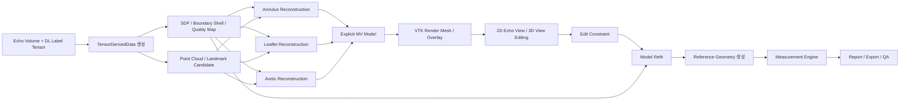
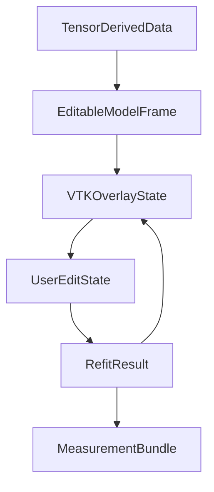
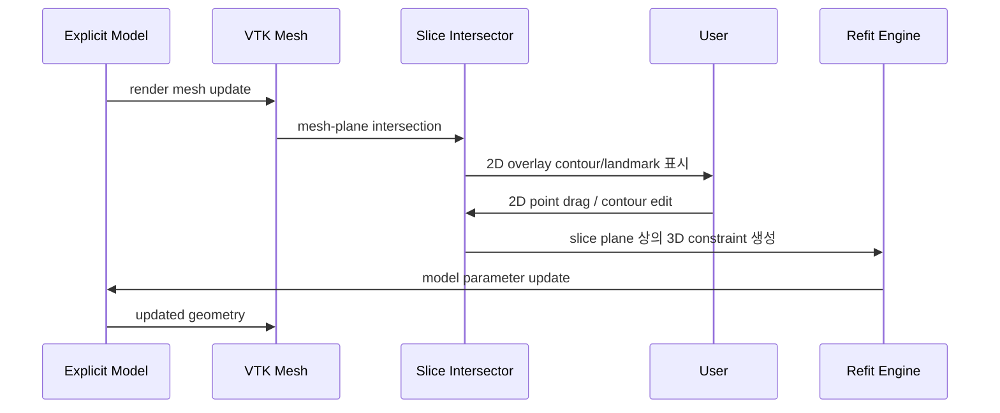
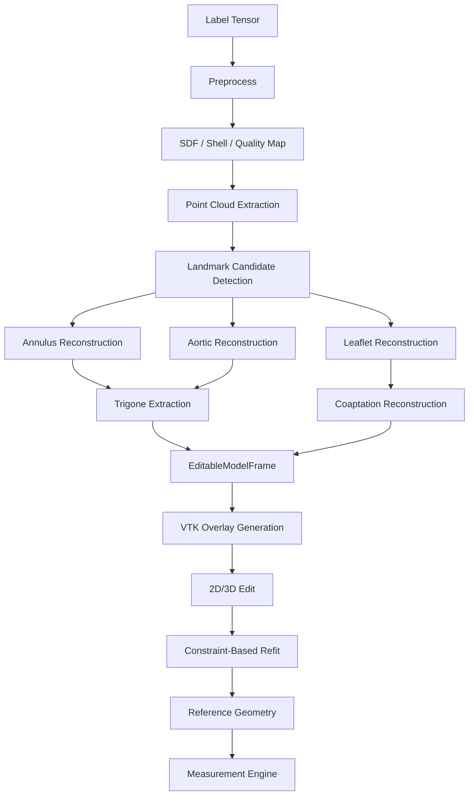
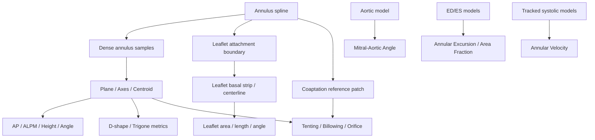

# Mitral Valve Quantification 엔진 아키텍처 설계

## 목적

이 문서는 다음 목표를 만족하는 `Mitral Valve Quantification (MVQ)` 엔진의 실현 가능성, 런타임 파이프라인, 시각화 구조, 사람 개입 워크플로우, tensor handoff 규약, trigone 도출 알고리즘, 그리고 GE `4D Auto MVQ` 대응 measurement 산출 알고리즘을 `바로 구현 가능한 수준`으로 정리한다.

- 입력:
  - 3D 또는 4D echo volume
  - 딥러닝 output `label tensor`
  - 선택적으로 class probability
  - 클래스: `annulus`, `anterior leaflet`, `posterior leaflet`, `aortic valve`
- 출력:
  - 사람이 수정 가능한 explicit mitral valve model
  - 2D echo/MPR 위에 overlay 가능한 3D model + landmark + contour
  - GE `4D Auto MVQ`와 실질적으로 동급의 measurement 세트
  - C++ 엔진 안에 넣을 수 있는 모듈형 구조

핵심 철학은 다음과 같다.

- segmentation 결과를 최종 truth로 쓰지 않는다
- segmentation tensor는 `evidence`이고, 최종 해는 `explicit anatomical model`이다
- 사람의 수정은 voxel 수정이 아니라 `landmark`, `curve`, `surface`, `coaptation` 수준에서 일어난다
- 최종 measurement는 explicit model에서 직접 계산한다
- VTK는 `canonical geometry`가 아니라 `render/edit representation`이다

## 한 장 요약

### 구현 결론

- `정적 end-systolic MVQ`: 구현 가능성이 높다
- `systolic tracking 기반 dynamic MVQ`: 구현 가능성이 높지만 추가 검증이 필요하다
- `full-cycle 자동 MVQ`: 가능하지만 2차 단계로 미루는 것이 안전하다
- `perforation/cleft topology-aware pathology`: MVQ core와 별도 layer로 분리하는 것이 좋다

### 권장 제품화 순서

1. `single-frame ES MVQ`
2. `human-in-the-loop edit/refit`
3. `measurement parity`
4. `systolic tracking`
5. `full-cycle dynamics`

## 전반 아키텍처

### End-to-End 시각화



### Runtime 상태 분리



### Source of Truth 계층

1. `TensorDerivedData`
2. `EditableModelFrame`
3. `VTKOverlayState`

즉 VTK는 충분히 써도 되지만, `derived evidence`와 `explicit model`은 반드시 별도로 유지해야 한다.

## 실현 가능성 및 정확도 검토

### 전제

현재 보유한 segmentation 모델은 `hard label output`을 낸다고 가정한다. 즉 softmax probability나 voxel-wise confidence는 직접 제공되지 않는다.

이 전제에서 고려해야 할 추가 조건은 다음과 같다.

- confidence를 후처리로 유도해야 함
- optimizer가 쓸 부드러운 데이터 항을 별도로 만들어야 함
- class 경계 근처의 애매함을 SDF나 shell 기반으로 복원해야 함

현재 보유한 segmentation 모델의 형상 한계는 다음과 같다.

- 표면이 일부 끊김
- class density가 일정하지 않음
- leaflet thickness/edge가 들쭉날쭉함
- annulus ring이 직접적 구조라기보다 주변 조직과 섞일 수 있음

이 조건에서는 `marching cubes -> smoothing -> measurement` 방식이 안정적이지 않다.

이유는 다음과 같다.

- topology가 매 프레임 달라질 수 있음
- local hole이 measurement에 직접 반영됨
- leaflet free edge와 coaptation을 안정적으로 정의하기 어려움
- 사람이 mesh vertex를 직접 수정하게 되면 workflow가 무너짐

따라서 voxel segmentation은 `hard evidence`의 출발점으로만 사용하고, explicit model fitting 전에 `derived soft evidence`를 만들어야 한다.

### 정확도 기대치

| 서브문제 | 권장 접근 | 기대 정확도 | 주 리스크 |
|---|---|---:|---|
| Annulus 초기화 | point cloud + spline fit + manual correction | 높음 | annulus ring evidence 약함 |
| Commissure/trigone 추정 | aortic continuity + AML/PML support + manual confirm | 중간 | fibrous trigone은 tensor만으로 약함 |
| Leaflet midsurface | SDF fitting + control mesh + coaptation prior | 중간~높음 | acoustic shadow, dropout |
| Aortic plane/root | aortic label + plane/ellipse fit | 높음 | aortic segmentation 약한 경우 |
| Tenting/Billowing | explicit model 기반 | 높음 | plane/reference 선택 민감 |
| Leaflet angle/length | basal strip / centerline 기반 | 중간~높음 | local tangent 안정성 필요 |
| Temporal tracking | propagated model + smoothing | 중간 | opening/closing transition |

### 제품 관점 리스크

- `trigone`은 자동만으로 확정하면 위험하다
- `coaptation line`은 segmentation class만으로는 약할 수 있다
- `annulus plane`과 `saddle reference` 정의에 따라 billowing/tenting 값이 달라진다
- frame selection이 틀리면 거의 모든 measurement가 흔들린다

따라서 UI에서 최소한 아래는 편집 가능해야 한다.

- anterior/posterior annulus point
- AL/PM commissure
- left/right trigone
- coaptation midpoint
- coaptation endpoints
- aortic center / aortic plane

## 좌표계와 시각화 설계

### 좌표계

반드시 아래 4개 좌표계를 분리한다.

1. `Tensor index space`
   - `(i, j, k)`
2. `Volume world space`
   - `mm`
   - spacing, origin, direction 반영
3. `Slice plane space`
   - 2D MPR/echo slice local coordinate
4. `Screen space`
   - UI pixel coordinate

### 좌표계 변환


### 2D overlay / edit 구조



### Overlay 편집이 성립하려면 필요한 것

- model이 `volume world space` 기준이어야 함
- 모든 landmark/curve/surface가 같은 물리 좌표계에 있어야 함
- 2D edit는 `slice plane 상의 3D constraint`로 역변환돼야 함

즉 “원본 초음파와 매칭이 끊긴다”는 문제는 `VTK만 소스로 쓰는 경우`에 생기는 것이고, 현재처럼 `overlay + canonical geometry + evidence` 구조라면 해결된다.

## Tensor handoff 설계

딥러닝 output tensor를 그대로 다음 단계에 들고 갈 필요는 없다. 대신 tensor에서 다음 구조를 추출해 넘긴다.

### TensorDerivedData

#### FrameMeta

- `frame_id`
- `phase`
- `spacing`
- `origin`
- `direction`
- `time_ms`

#### VolumeEvidence

- `hard_labels`
- `annulus_sdf`
- `aml_sdf`
- `pml_sdf`
- `aortic_sdf`
- `annulus_boundary_shell`
- `aml_boundary_shell`
- `pml_boundary_shell`
- `aortic_boundary_shell`
- `quality_map_annulus`
- `quality_map_aml`
- `quality_map_pml`
- `quality_map_aortic`

#### PointClouds

- `annulus_point_cloud`
- `aml_surface_point_cloud`
- `pml_surface_point_cloud`
- `aortic_surface_point_cloud`

#### Components

- class별 connected component stats
- voxel count
- bounding box
- centroid
- mean quality

#### Candidate landmarks

- `anterior annulus`
- `posterior annulus`
- `AL commissure`
- `PM commissure`
- `aortic center`
- `aortic normal candidate`
- `AML attachment center`
- `PML attachment center`
- `mitral centroid`

### 왜 tensor 자체를 버려도 되는가

tensor에서 다음을 이미 만들었기 때문이다.

- continuous attraction field: `SDF`
- boundary 강조 정보: `boundary shell`
- 품질 가중치: `quality map`
- geometry seed: `point cloud`
- sparse seed: `candidate landmark`

즉 handoff는 `raw tensor`가 아니라 `tensor-derived evidence package`를 넘기는 구조가 맞다.

## Tensor에서 추출해야 할 landmark 목록

### 바로 추출

- `Anterior annulus point`
- `Posterior annulus point`
- `AL commissure`
- `PM commissure`
- `Aortic center`
- `Aortic annulus plane normal candidate`
- `AML attachment center`
- `PML attachment center`
- `Mitral centroid`

### geometry + evidence로 파생

- `Left trigone`
- `Right trigone`
- `Coaptation midpoint`
- `Coaptation AL endpoint`
- `Coaptation PM endpoint`
- `A2 center`
- `P2 center`
- `Anterior horn`
- `Posterior midpoint`
- `LV long-axis reference`

### 사람 확인 필수

- `Left trigone`
- `Right trigone`
- `Coaptation line`
- `Orifice boundary`
- `Aorto-mitral continuity midpoint`

## 구체 파이프라인

### 전체 흐름



### Step 1. Preprocess

입력:

- intensity volume
- hard label tensor

출력:

- cleaned label tensor
- class별 connected component

절차:

1. spacing normalization 정보 확보
2. class별 binary mask 분리
3. 작은 component 제거
4. 필요 시 opening/closing
5. class별 component ranking

### Step 2. Derived evidence 생성

입력:

- cleaned label tensor

출력:

- class별 SDF
- class별 boundary shell
- class별 quality map

절차:

1. 각 class mask에 대해 inside/outside Euclidean distance transform 계산
2. signed distance field 생성
3. boundary에서 일정 두께 band를 잘라 shell 생성
4. local continuity, component size, local thickness 기반 quality weight 생성

### Step 3. Point cloud 추출

입력:

- class mask / shell

출력:

- annulus / AML / PML / aortic point cloud

절차:

1. shell voxel 중심을 world space point로 변환
2. quality를 point weight로 저장
3. class별 point cloud 생성

### Step 4. Landmark candidate detection

입력:

- point cloud
- SDF
- shell

출력:

- candidate landmark set

절차:

1. annulus point cloud로 초기 local frame 추정
2. AP axis, commissural axis 후보 생성
3. annulus extremes에서 anterior/posterior point 후보 생성
4. commissural extremes에서 AL/PM 후보 생성
5. aortic point cloud에서 aortic center / plane 후보 생성
6. AML/PML attachment 중심 후보 생성

### Step 5. Annulus reconstruction

입력:

- annulus point cloud
- annulus SDF
- annulus landmarks

출력:

- periodic spline annulus

절차:

1. annulus point cloud PCA로 local valve frame 생성
2. ellipse-like closed curve로 초기화
3. saddle prior 추가
4. SDF + landmark + smoothness energy로 spline fit
5. dense sampled annulus 생성

### Step 6. Aortic reconstruction

입력:

- aortic point cloud
- aortic SDF

출력:

- aortic annulus plane
- aortic annulus curve
- root axis

절차:

1. aortic point cloud centroid 계산
2. robust plane fit
3. plane 위 projected ellipse/circle fit
4. root axis 추정

### Step 7. Leaflet reconstruction

입력:

- AML/PML SDF
- AML/PML point cloud
- annulus model
- aortic model

출력:

- AML control mesh / render mesh
- PML control mesh / render mesh

절차:

1. annulus attachment boundary 초기화
2. control mesh template 생성
3. leaflet SDF에 맞춰 surface fitting
4. annulus attachment constraint 적용
5. AML/PML free edge 추정
6. dense render mesh 생성

### Step 8. Trigone extraction

입력:

- annulus sampled curve
- aortic plane / point cloud
- AML/PML point cloud

출력:

- left trigone
- right trigone
- anterior fibrous arc

알고리즘은 아래 전용 섹션에 상세히 기술한다.

### Step 9. Coaptation reconstruction

입력:

- AML/PML surfaces

출력:

- coaptation curve
- coaptation midpoint
- contact patch
- orifice patch

절차:

1. AML/PML free edge 후보 생성
2. inter-leaflet gap field 계산
3. gap가 작은 ridge를 coaptation curve로 선택
4. contact patch 생성
5. residual open region이 있으면 orifice patch 생성

### Step 10. VTK overlay generation

입력:

- explicit model

출력:

- vtkPolyData
- slice intersection contour
- overlay landmark glyph

절차:

1. annulus / leaflet / aortic model을 vtkPolyData로 변환
2. 현재 slice plane과 교차
3. 2D contour와 landmark를 overlay

### Step 11. Human edit / refit

입력:

- user drag / point move / contour replace

출력:

- edited explicit model

절차:

1. user edit를 slice-plane constraint로 변환
2. constraint를 world space로 back-project
3. model parameter에 hard/soft constraint 추가
4. evidence를 유지한 채 refit
5. VTK overlay 갱신

### Step 12. Measurement

입력:

- final explicit model
- optional ED/ES pair
- optional tracked systolic frames

출력:

- measurement bundle

절차:

1. reference geometry 생성
2. measurement dependency graph 순서로 계산
3. invalid / low-confidence flag 부여

## Trigonal point 도출 알고리즘

### 해부학 전제

- trigone은 anterior annulus의 양 끝점이다
- 이 구간은 `aorto-mitral curtain`과 연속된다
- posterior annulus보다 섬유성이고 rigid하다
- `inter-trigonal distance`는 중요한 임상 measurement다

### 입력

- annulus sampled curve
- aortic annulus plane
- aortic point cloud
- AML point cloud
- PML point cloud
- optional seed trigone

### 출력

- `left trigone`
- `right trigone`
- `anterior fibrous arc`
- `continuity score`

### Stage 1. anterior fibrous arc score 계산

annulus sampled point 각각 `p_i`에 대해 다음 scalar score를 계산한다.

\[
S(p_i)=
w_1\exp(-d_{AoPlane}(p_i)^2/\sigma_1^2)+
w_2\exp(-d_{AoCloud}(p_i)^2/\sigma_2^2)+
w_3 H_{annulus}(p_i)+
w_4 A_{AML}(p_i)-
w_5 A_{PML}(p_i)
\]

#### 각 항의 구현

1. `d_AoPlane(p_i)`
   - aortic annulus plane까지의 절대 signed distance
2. `d_AoCloud(p_i)`
   - aortic point cloud까지의 최근접 거리
3. `H_annulus(p_i)`
   - annulus best-fit plane 기준 normalized height
4. `A_AML(p_i)`
   - AML point cloud에 가까울수록 높아지는 score
5. `A_PML(p_i)`
   - PML point cloud에 가까울수록 높아지는 penalty

권장 초기 가중치:

- `w1 = 0.35`
- `w2 = 0.30`
- `w3 = 0.25`
- `w4 = 0.20`
- `w5 = 0.15`

### Stage 2. peak 기반 anterior arc 추출

1. `S(p_i)` 최대값을 갖는 peak index를 찾는다
2. peak 점수를 기준으로 `peak * 0.70` 이상인 연속 구간을 좌우로 확장한다
3. 그 연속 구간을 `anterior fibrous arc`로 정의한다

### Stage 3. arc endpoint를 trigone 후보로 정의

1. anterior arc의 양 endpoint를 추출한다
2. commissural axis 기준으로 left/right orientation을 부여한다
3. seed trigone이 이미 있으면 `6 mm` 이내에서 snap/refine 한다

### Stage 4. sanity check

반드시 아래 조건을 체크한다.

- endpoint가 commissure와 지나치게 가까운가
- endpoint 근처에서 annulus curvature가 급격히 깨지는가
- AML support가 유지되는가
- aortic continuity score가 충분한가

실패 시:

- low-confidence flag 부여
- user-confirm-required 상태로 넘긴다

## Human-in-the-loop 편집 설계

### 직접 수정 가능한 것

- annulus handle
- commissure
- trigone
- coaptation midpoint / endpoint
- leaflet contour on slice
- aortic point / plane

### 직접 수정하면 안 되는 것

- raw voxel
- dense triangle vertex 전체
- topology connectivity

### edit를 constraint로 바꾸는 방식

1. user가 2D slice 위에서 점/선/contour를 움직임
2. 해당 점은 slice plane 상의 3D 점으로 back-project
3. edit type에 따라 constraint 생성

- landmark move -> point hard constraint
- contour replace -> curve soft constraint
- leaflet push/pull -> local surface positional constraint
- lock -> optimization frozen variable

4. refit engine이 evidence + constraint를 함께 풀어 explicit model을 갱신

## Measurement 계산을 위한 공통 reference geometry

measurement를 직접 계산하기 전에 아래 reference를 항상 만든다.

### R0. Dense annulus samples

- annulus spline을 arc-length 균일 샘플링
- 권장 sample 수: `128~256`

### R1. Annulus best-fit plane

- annulus dense sample에 robust plane fit

### R2. Annulus local frame

- origin: annulus centroid
- `e_ap`: anterior-posterior axis
- `e_comm`: commissural axis
- `n_mv`: annulus plane normal

### R3. Landmark set

- anterior horn
- posterior midpoint
- AL commissure
- PM commissure
- left trigone
- right trigone

### R4. D-shape model

- trigone-to-trigone anterior chord
- posterior arc

### R5. Aortic reference

- aortic annulus plane
- aortic normal `n_ao`

### R6. Leaflet basal strip

- annulus attachment에서 `3~5 mm` 범위 strip
- AML / PML 각각 생성

### R7. Leaflet representative centerline

- A2 중심선
- P2 중심선

### R8. Coaptation reference

- coaptation curve
- coaptation midpoint
- contact patch
- orifice patch

### R9. Signed displacement field on leaflet

\[
h(x)=d(x,\Pi_{annulus})
\]

또는 내부 저장으로

\[
h_s(x)=d(x,\Sigma_{saddle})
\]

### R10. LV long axis

- ED/ES pair 또는 사용자/영상 기반 reference axis

## Measurement dependency graph



## Measurement 항목별 구현 알고리즘

아래 단계는 `입력 -> 전처리 -> 계산 -> fallback` 순서로 썼다. 구현 시 함수 단위로 그대로 분리하면 된다.

### 1. Annulus Perimeter

입력:

- `R0 Dense annulus samples`

단계:

1. annulus spline을 arc-length 균일 샘플링한다
2. 인접 샘플 간 3D 거리 합을 구한다
3. 폐곡선이므로 마지막 샘플과 첫 샘플 사이 거리도 더한다

출력:

\[
P=\sum_i \|p_{i+1}-p_i\|
\]

fallback:

- dense sample이 없으면 spline control polygon 길이는 쓰지 말고 샘플링 후 계산한다

### 2. Annulus Area 3D

입력:

- `R0 Dense annulus samples`
- `R1 Annulus best-fit plane`

단계:

1. annulus sample을 best-fit plane basis로 2D parameterization 한다
2. 2D polygon triangulation을 만든다
3. 각 triangle vertex index를 원래 3D annulus sample에 대응시킨다
4. 3D triangle area를 모두 합한다

출력:

\[
A_{3D}=\sum_t A_t^{3D}
\]

fallback:

- triangulation 실패 시 annulus centroid fan triangulation 사용

### 3. Annulus Area 2D

입력:

- `R0 Dense annulus samples`
- `R1 Annulus best-fit plane`

단계:

1. annulus sample을 plane basis `(u, v)`로 투영한다
2. 2D polygon을 만든다
3. shoelace formula를 적용한다

출력:

\[
A_{2D}=\frac{1}{2}\left|\sum_i x_i y_{i+1}-x_{i+1} y_i\right|
\]

### 4. A-P Diameter

입력:

- `anterior horn`
- `posterior midpoint`

단계:

1. anterior horn를 확정한다
2. annulus anterior point의 반대편 posterior arc midpoint를 계산한다
3. 두 점의 3D 직선 거리를 계산한다

출력:

\[
d_{AP}= \|p_{ant}-p_{post}\|
\]

### 5. AL-PM Diameter

입력:

- `AL commissure`
- `PM commissure`

단계:

1. commissure 두 점을 확정한다
2. 3D 직선 거리 계산

### 6. Commissural Diameter

입력:

- `AL commissure`
- `PM commissure`

단계:

1. `AL-PM Diameter`와 동일하게 계산한다
2. 별도 alias로 저장한다

### 7. Inter-Trigonal Distance

입력:

- `left trigone`
- `right trigone`

단계:

1. trigone extractor 결과를 가져온다
2. user edit가 있으면 edit된 landmark를 우선한다
3. 두 trigone 간 3D 거리 계산

### 8. D-Shaped Annulus Area

입력:

- `left trigone`
- `right trigone`
- posterior annulus arc

단계:

1. trigone-to-trigone anterior chord를 만든다
2. posterior annulus arc와 chord를 이어 D-shape polygon을 만든다
3. polygon을 annulus plane에 투영한다
4. shoelace formula로 area 계산

### 9. D-Shaped Annulus Perimeter

입력:

- same as above

단계:

1. posterior annulus arc length 계산
2. trigone-to-trigone chord length 계산
3. 둘을 합한다

### 10. Annulus Height

입력:

- `R0 Dense annulus samples`
- `R1 Annulus best-fit plane`

단계:

1. 각 annulus sample에 대해 plane signed distance 계산
2. 최대값과 최소값을 구한다
3. 차이를 height로 정의한다

\[
H = \max(h_i)-\min(h_i)
\]

### 11. Non-Planar Angle

입력:

- `anterior horn`
- `posterior midpoint`
- `AL commissure`
- `PM commissure`

단계:

1. commissural midpoint를 계산한다
2. `v_a = anterior - commissural_midpoint`
3. `v_p = posterior - commissural_midpoint`
4. commissural axis를 포함하는 local plane으로 투영한다
5. 투영된 두 벡터 사이 각도를 계산한다

fallback:

- 각도 정의가 모호하면 동일한 구현을 유지하고 validation dataset에서 freeze한다

### 12. Mitral-Aortic Angle

입력:

- mitral annulus plane normal
- aortic annulus plane normal

단계:

1. 두 normal을 normalize
2. dot product 계산
3. arccos 적용

\[
\theta=\cos^{-1}(n_{MV}\cdot n_{Ao})
\]

### 13. Mitral Annular Excursion

입력:

- `ED annulus model`
- `ES annulus model`
- `LV long axis`

단계:

1. ED annulus centroid 계산
2. ES annulus centroid 계산
3. displacement vector 계산
4. LV long-axis 방향 성분만 취한다

\[
MAE = (c_{ES}-c_{ED}) \cdot \hat{a}_{LV}
\]

### 14. Annular Area Fraction

입력:

- `ED annulus area`
- `ES annulus area`

단계:

1. ED 2D 또는 3D area 사용 여부를 제품 정의로 고정한다
2. 아래 식 계산

\[
AAF = \frac{A_{ED}-A_{ES}}{A_{ED}}
\]

### 15. Annular Velocity

입력:

- tracked systolic annulus centroid
- frame timestamps
- LV long axis

단계:

1. 각 frame의 annulus centroid 계산
2. centroid를 LV long axis로 projection
3. finite difference로 velocity 계산
4. peak systolic velocity 또는 mean systolic velocity 중 하나를 제품 정의로 고정한다

### 16. Anterior Leaflet Area

입력:

- AML midsurface mesh

단계:

1. AML mesh의 triangle area를 모두 합산
2. 두께 surface가 아니라 midsurface만 사용

### 17. Posterior Leaflet Area

입력:

- PML midsurface mesh

단계:

1. PML mesh의 triangle area를 모두 합산

### 18. Anterior Leaflet Length

입력:

- `A2 representative centerline`

단계:

1. AML attachment boundary에서 A2 대표 시작점을 찾는다
2. free edge 방향으로 중심 representative path를 만든다
3. geodesic length 또는 centerline polyline length를 계산한다

fallback:

- centerline 추출 실패 시 local shortest geodesic를 사용한다

### 19. Posterior Leaflet Length

입력:

- `P2 representative centerline`

단계:

1. PML attachment boundary에서 P2 representative path를 추출한다
2. geodesic length 계산

### 20. Anterior Leaflet Angle

입력:

- AML basal strip
- annulus plane

단계:

1. AML basal strip에서 local centerline tangent 또는 local fitted plane normal을 계산한다
2. annulus plane과 이루는 각도를 계산한다
3. 정의 혼동을 막기 위해 구현 시 tangent 기반인지 normal 기반인지 고정한다

### 21. Posterior Leaflet Angle

입력:

- PML basal strip
- annulus plane

단계:

1. PML basal strip에서 local tangent 또는 normal 계산
2. annulus plane과 각도 계산

### 22. Tenting Height

입력:

- `coaptation midpoint`
- `annulus plane`

단계:

1. coaptation midpoint를 계산한다
2. annulus plane signed distance를 계산한다
3. ventricular side magnitude를 tenting height로 사용한다

### 23. Tenting Area

입력:

- annulus
- AML/PML surface
- coaptation reference

권장 제품 정의:

- `A2-P2 절단면 기반 2D sectional area`

단계:

1. A2-P2를 통과하는 long-axis plane을 정의한다
2. annulus, AML, PML, coaptation을 이 plane으로 절단한다
3. 절단된 annulus chord와 leaflet contour가 이루는 폐곡선을 만든다
4. 2D polygon area를 계산한다

### 24. Tenting Volume

입력:

- leaflet surface
- annulus reference patch
- signed displacement field

단계:

1. annulus spanning patch를 만든다
2. leaflet signed displacement에서 ventricular side negative 값만 취한다
3. 삼각형 단위로 displacement 적분을 수행한다

\[
V_t = \int_{\Omega}\max(-h(x),0)dA
\]

### 25. Billowing Height

입력:

- leaflet signed displacement field

단계:

1. 각 leaflet vertex의 signed displacement 계산
2. atrial side positive 값만 취한다
3. 최대값을 billowing height로 저장한다

### 26. Billowing Area

입력:

- leaflet signed displacement field

단계:

1. `h(x) > 0`인 triangle patch를 찾는다
2. 해당 triangle area를 합산한다

### 27. Billowing Volume

입력:

- leaflet signed displacement field

단계:

1. positive displacement만 유지한다
2. triangle area에 평균 positive displacement를 곱해 적분한다

\[
V_b = \int_{\Omega}\max(h(x),0)dA
\]

### 28. Coaptation Length

입력:

- coaptation curve

단계:

1. coaptation polyline을 충분히 샘플링한다
2. polyline arc length 계산

### 29. Coaptation Area

입력:

- contact patch

단계:

1. AML/PML gap field를 계산한다
2. gap가 작고 서로 마주보는 patch를 contact patch로 확정한다
3. patch mesh area를 계산한다

### 30. Orifice Area

입력:

- coaptation failure region
- orifice patch

단계:

1. free edge / closure gap field를 계산한다
2. threshold 이상 open region을 찾는다
3. connected component 중 primary orifice를 선택한다
4. 해당 patch의 area를 계산한다

중요:

- central malcoaptation에는 적용 가능
- leaflet perforation hole은 별도 pathology layer 없이는 직접 표현되지 않는다

## 바로 구현하기 위한 실행 순서

### Phase A. static ES MVP

1. `TensorFeatureExtractor`
2. `AnnulusReconstructor`
3. `AorticReconstructor`
4. `LeafletReconstructor`
5. `TrigoneExtractor`
6. `CoaptationReconstructor`
7. `OverlayGenerator`
8. `MeasurementEngine`

### Phase B. interactive refinement

1. 2D slice overlay
2. edit constraint 생성
3. refit
4. measurement recompute

### Phase C. dynamic extension

1. ES seed model 준비
2. systolic propagation
3. frame별 annulus / leaflet tracking
4. excursion / velocity 계산

## 최소 구현 함수 세트

```cpp
TensorDerivedData BuildTensorDerivedData(
    const IntensityVolume& intensity,
    const LabelVolume& hard_labels);

AnnulusModel ReconstructAnnulus(
    const TensorDerivedData& td,
    const LandmarkSet& seed);

AorticModel ReconstructAortic(
    const TensorDerivedData& td,
    const LandmarkSet& seed);

LeafletModel ReconstructLeaflet(
    LabelClass leaflet_label,
    const TensorDerivedData& td,
    const AnnulusModel& annulus,
    const AorticModel& aortic,
    const LandmarkSet& seed);

TrigoneExtractionResult ExtractTrigones(
    const TensorDerivedData& td,
    const AnnulusModel& annulus,
    const AorticModel& aortic,
    const LandmarkSet& seed);

CoaptationModel ReconstructCoaptation(
    const LeafletModel& aml,
    const LeafletModel& pml,
    const AnnulusModel& annulus);

MeasurementBundle ComputeMeasurements(
    const MitralValveModel& es_model,
    const std::optional<MitralValveModel>& ed_model,
    const std::vector<MitralValveModel>& systolic_models);
```

## 검증 전략

### 단계별 검증

1. segmentation vs explicit model overlap
2. annulus landmark repeatability
3. trigone repeatability
4. leaflet surface distance error
5. coaptation stability
6. measurement reproducibility
7. human edit before/after difference
8. intra/inter-observer variability

### 권장 지표

- mean surface distance
- 95% Hausdorff
- landmark error
- measurement ICC
- manual vs auto Bland-Altman

## 최종 권장 구현 방향

한 줄로 정리하면 다음이다.

`voxel label -> derived SDF/shell/quality/landmark 후보 -> explicit anatomical model -> VTK overlay -> user edit -> constrained refit -> measurement`

이 구조가 좋은 이유:

- 끊긴 segmentation에도 견딤
- 원본 초음파와 overlay 편집이 가능함
- trigone과 coaptation 같은 약한 구조를 auto + user confirm으로 다룰 수 있음
- GE류 MVQ measurement와 잘 맞음
- C++ 엔진으로 모듈화하기 좋음

## 참고 출처

- [GE 4D Auto MVQ white paper](https://www.gehealthcare.com/-/jssmedia/c7b01e1710ac43268cfb3c63d42b4db6.pdf)
- [ECHOPAC 202 conformance statement](https://www.gehealthcare.com/-/media/post-widen/2018/05/28/gehc-dicom-conformance_echopac-v202_doc1969201_rev2.pdf?hash=973850B8ECBF4424182C57AA5EA9338F&rev=-1)
- [Assessment of D-shaped annulus with GE 4D Auto MVQ](https://pmc.ncbi.nlm.nih.gov/articles/PMC7711883/)
- [Quantitative mitral valve modeling using RT3D echocardiography](https://pubmed.ncbi.nlm.nih.gov/21172507/)
- [Mitral annular dynamics review](https://pmc.ncbi.nlm.nih.gov/articles/PMC10846232/)
